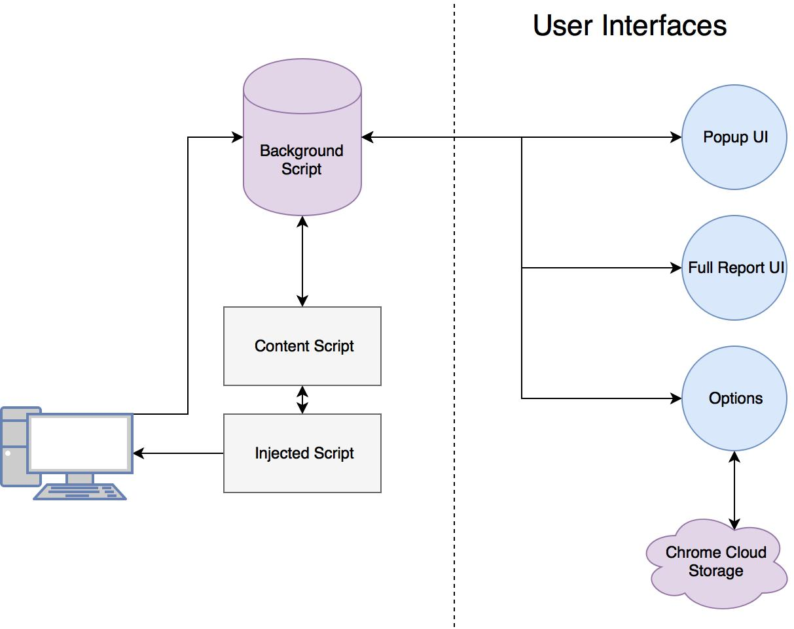

# MightyHive Chrome Extension

## Architecture
Due to the isolated runtime design of Chrome's extensions, there are multiple services and apps produced by this repo.



**manifest.json**
  - Provides information about the extension, requests permissions, and declares assets. [See more here.](https://developer.chrome.com/extensions/manifest)

**config**
  - Provides the configuration settings that each of the services use, such as Data Layer names.

**Background Script**
  - Also called a "background page" in Chrome documentations, this script acts as a web server for the rest of the services. It persists, manages, and adds data from other services. The Background Script is the backbone of the entire ecosystem, and unlike every other script stays running. 

**Content Script**
  - The Content Script is an intermediary between the Injected Script and the Background Script. The Content Script runs whenever a new pages is loaded. 
  - The Content Script is responsible for both injecting the Injected Script and listening for its response. 

**Injected Script**
  - The runtime restrictions of Chrome make accessing properties of the `window` object within a user's browsing session extremely difficult. Thus, the Injected Script is inserted _into the page itself_ and can access the same runtime environment. Once it has collected data, it passes that data to the Content Script via a custom DOM event. Since the Content Script shares the same DOM as the Injected Script, it is able to collect this data.

**Popup Page**
  - The primary UI of the application, the Popup page is displayed when the user clicks on the Browser Action button (the Mighty Hive icon) in the corner of their browser. The Popup page requests data from the Background Script and hydrates itself when received. 

**Full Report Page (w/ Report Script)**
  - Opened via a button from the Popup page, the Full Report fetches tab data from the Background Script and populates a more verbose UI that allows users a more intricate look at their page's activity.

**Options Page**
  - Displays a basic UI that enables users to change their options from the Chrome Extensions management page. This page is actually opened in a modal on that page, not as a new tab. This is to accomodate Chrome's [planned deprecation](https://developer.chrome.com/extensions/optionsV2) of the "new tab" functionality. 

## Setup
**Requirements:**
 - NodeJS `v4.4.3`.
   - `nvm` users can automatically switch to the correct version by running `$ nvm use`.

**Recommended:**
- ESLint integration with your IDE.

**Installation:**
```bash
npm install
```

## Generate a build

Builds are built from the `src/` folder and placed into the `dist/` directory. To create a distributable build, run `npm run build`.

## Contributing

This project utilizes Commitizen for its commit messages, with the `cz-conventional-changelog` preset. To set this up, install Commitizen globally: `npm i -g commitizen`. Local installations will _not_ create the Git alias for writing commits. 

To use, replace `git commit` in your workflow with `git cz` and select the appropriate category for your commmits.
